# Chapter 1 The Development of Writing

Nearly every type of letter with which we are familiar is derived from the Roman Capitals, and has come to us through the medium, or been modified by the influence, of the pen. And, therefore, in trying to revive good Lettering, we cannot do better than make a practical study of the best pen-forms, and learn at the same time to appreciate the forms of their magnificent archetypes as preserved in the monumental Roman inscriptions.

The development and the relations of the principal types of letters are briefly set out in the accompanying “family tree”—\[fig. 1\]. When the student has learnt to cut and handle a pen, he can trace this development practically by trying to copy a few words from each example given below.

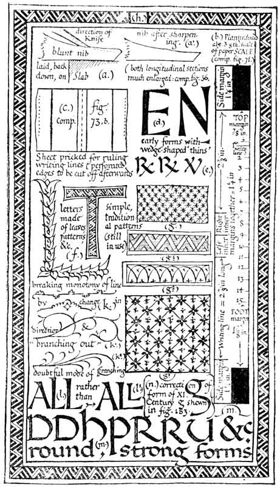

**THE ROMAN ALPHABET** __— The Alphabet, as we know it, begins with the ROMAN CAPITALS \[footnote [5](../footnotes-f/footnotes-to-part-i.md)\] \(see fig. 2\). Their fine monumental forms were evolved by the use of the chisel—probably under the influence of writing—and had reached full development about 2000 years ago \(see Plates [I](../plates/plate-i.md)., [II.](http://www.gutenberg.org/files/47089/47089-h/47089-h.htm#plate02), and Chapter XV.\).

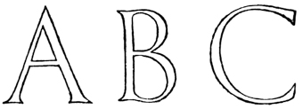

**FORMAL WRITING** — the “_book-hand_” or professional writing of the scribes—comes of the careful writing of the Roman Capitals \(see also \[_footnote_ [8](../footnotes-f/footnotes-to-part-i.md)\], on the beginnings of fine penmanship\). It was the — “_literary hand_, used in the production of exactly written MSS., and therefore a hand of comparatively limited use. By its side, and of course of far more extensive and general use, was the _cursive hand_ of the time” \[footnote [6](../footnotes-f/footnotes-to-part-i.md)\]

\[p037\]

In early _**cursive writing**_ — the running-hand or ordinary writing of the people — “The Letters are nothing more than the old Roman letters written with speed, and thus undergoing certain modifications in their forms, which eventually developed into the _minuscule hand_.” \[footnote [7](../footnotes-f/footnotes-to-part-i.md)\] \(See fig. 3.\)

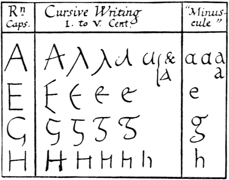

Here it is sufficient to trace the history of the _formal_ Latin “hands,” but the continual, modifying influence exerted on them by the ordinary _cursive_ writing should be borne in mind. Notable results of this influence are seen in _Half-Uncials_ and _Italics_.

**SQUARE CAPITALS** were formal, pen-made Roman Capitals, of the monumental type: they were used \(perhaps from the _second_\) till about the end of the _fifth_ century for important books \(see Plate III.\).

 \[p038\]

**RUSTIC CAPITALS** were probably a variety of the “Square Capitals,” and were in use till about the end of the _fifth_ century \(fig. [4](http://www.gutenberg.org/files/47089/47089-h/47089-h.htm#fig04); see also p. [297](http://www.gutenberg.org/files/47089/47089-h/47089-h.htm#p297)\).

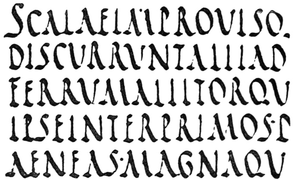

_**ROMAN UNCIALS**_ ****were fully developed by the fourth century, and were used from the fifth till the eighth century for the finest books \(fig. 5\).

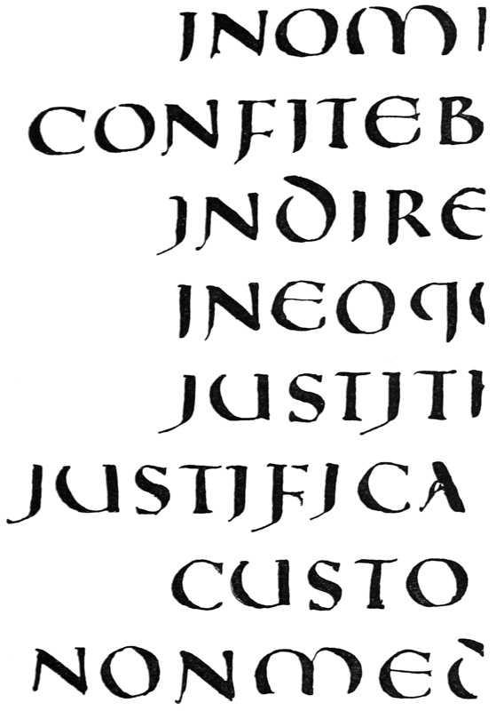

Uncials are true pen-forms\[[footnote 8](../footnotes-f/footnotes-to-part-i.md)\]—more quickly written than the “Square,” and clearer than the “Rustic” Capitals—having the characteristic, simple strokes and beautiful, rounded shapes which flow from the rightly handled reed or quill. The \[p040\]typical Uncial letters are the round D, E, H, M, U \(or V\), and A and Q \(see p. 300\).

**ROMAN HALF-UNCIALS**—or _Semi-Uncials_—\(fig. 6\) were mixed _Uncial_ and _Cursive_ forms adopted by the scribes for ease and quickness in writing. Their evolution marks the formal change from _Capitals_ to “_Small-Letters_.”

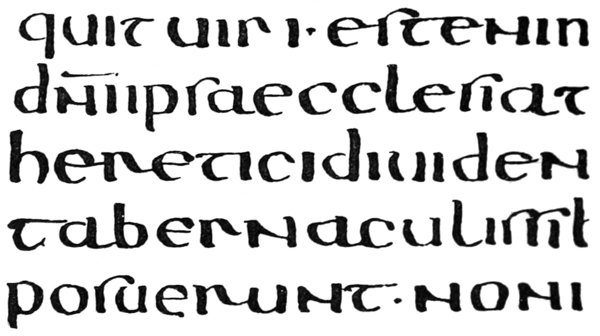

They were first used as a book-hand for the less important books about the beginning of the sixth century.

_**IRISH HALF-UNCIALS**_ were founded on the Roman Half-Uncials \(probably brought to Ireland by Roman missionaries in the sixth century\). As a beautiful writing, they attained in the seventh century a degree of perfection since unrivalled \(see Plate VI.\).

They developed in the eighth and ninth centuries into a “pointed” writing, which became the Irish national hand.

**ENGLISH HALF-UNCIALS** \(fig. 7\) were modelled on the Irish Half-Uncials in the seventh \[p041\]century. They also developed in the eighth and ninth centuries into a “pointed” writing.

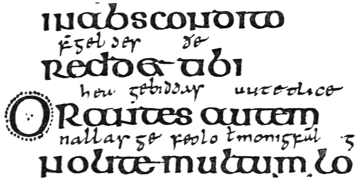

**CAROLINE \(or CARLOVINGIAN\) WRITING.**—While English and Irish writing thus came from Roman Half-Uncial, the Continental hands were much influenced by the rougher Roman Cursive, and were, till near the end of the eighth century, comparatively poor.

“The period of Charlemagne is an epoch in the history of the handwritings of Western Europe. With the revival of learning naturally came a reform of the writing in which the works of literature were to be made known. A decree of the year 789 called for the revision of church books; and this work naturally brought with it a great activity in the writing schools of the chief monastic centres of France. And in none was there greater activity than at Tours, where, under the rule of Alcuin of York, who was abbot of St. Martin’s from 796 to 804, was specially developed the exact hand which has received the name of the Caroline Minuscule.”[\[footnote 9\]](../footnotes-f/footnotes-to-part-i.md)\[p042\]

\[p043\]

The influence of the Caroline hands \(see fig. 8\) presently spread throughout Europe. The letters in our modern copy-books may be regarded as their direct, though degenerate, descendants.

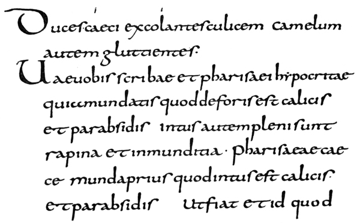

**SLANTED-PEN or TILTED WRITING.**—The forms of the letters in early writing indicate an easily held pen—slanted away from the right shoulder. The slanted pen naturally produced _oblique_ thick strokes and thin strokes, and the letters were “tilted” \(see fig. 9\).

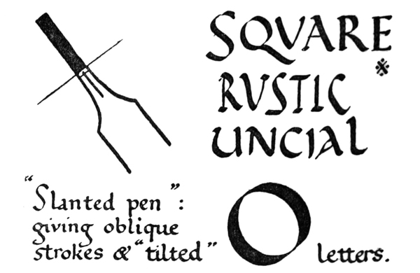

In the highly finished hands—used from the sixth to the eighth centuries—such as the later Uncials and the Roman, Irish, and English Half-Uncials, the pen was manipulated or cut so that the thin strokes were approximately horizontal, and the thick strokes vertical \(fig. 10\). The earlier and easier practice came into fashion again in the eighth and ninth centuries, and the round Irish and English hands became “pointed” as a result of slanting the pen.

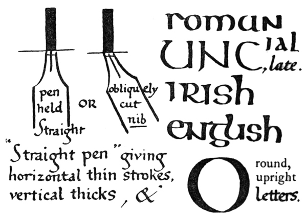

The alteration in widths and directions of pen strokes, due to the use of the “slanted pen,” had these effects on the half-uncial forms \(see fig. 11\):—

1. _The thin strokes taking an oblique_ \(_upward_\) _direction_ \(_a_\) \(giving a sharp angle with the verticals \(_d_, _a_\)\) led to angularity and narrower forms \(_a_1\), and a marked contrast between thick and thin strokes—due to the abrupt change from one to the other \(_a_2\).
2. _The thick strokes becoming oblique_ \(_b_\) caused a thickening of the curves below on the left \(_b_1\), and above on the right \(_b_2\), which gave heavy shoulders and feet.
3. _The horizontal strokes becoming thicker_ \(_c_\) gave stronger and less elegant forms.\[p044\]
4. _The vertical strokes becoming thinner_ \(_d_\) \(with oblique or pointed ends—not square ended\) increased the tendency to narrow letters.

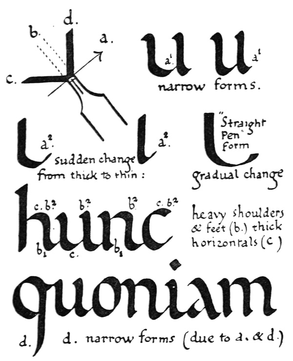

\[p045\]

It is to be noted that the Caroline letters—though written with a “slanted pen”—kept the open, round appearance of the earlier forms.

\[p046\]

**TENTH, ELEVENTH, AND TWELFTH CENTURY WRITING.**—The easy use of the slanted pen, and the lateral compression of the letters which naturally followed, resulted in a valuable economy of time and space in the making of books. This lateral compression is strongly marked in the tenth century \(see fig. 12\), and in the eleventh and twelfth centuries it caused curves to give place to angles, and writing to become “_Gothic_” in character \(see Plate XI.\).

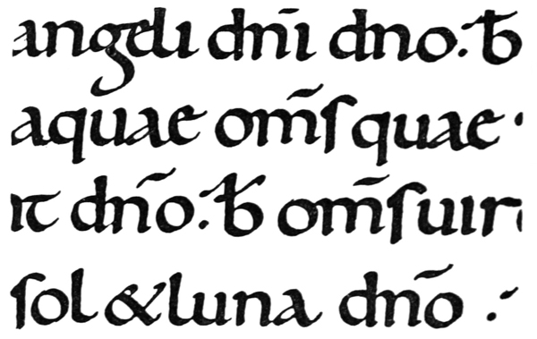

**THIRTEENTH, FOURTEENTH, AND FIFTEENTH CENTURY WRITING**_._—The tendency to compression continued, and a further economy of space was effected in the thirteenth and fourteenth centuries by the general use of much smaller writing \(see fig. 13\). In the fifteenth century writing grew larger and taller again, but the letters had steadily become narrower, more angular, and stiffer, till the written page consisted of rows of perpendicular thick strokes with heads and feet connected by oblique hair-lines—which often look as if they had been dashed in after with a fine pen—all made with an almost mechanical precision \(see Plate XVII.\).

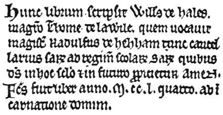

\[p047\]

**ITALIAN WRITING.**—In Italy alone the roundness of the earlier hands was preserved, and though in course of time the letters were affected by the “Gothic” tendency, they never lost the curved forms or acquired the extreme angularity which is seen in the writings of Northern Europe \(compare Plates X. and XI.\).

At the time of the Renaissance the Italian scribes remodelled their “hands” on the beautiful Italian writing of the eleventh and twelfth centuries \(see Plates X. and XVIII., XIX., XX.\). The early Italian printers followed after the scribes and modelled their types on these round clear letters. And thus the fifteenth century Italian formal writing became the foundation of the “_Roman_” _small letters_, which have superseded all others for the printing of books.

\[p048\]

**ITALICS.**—The Roman Letters, together with the cursive hand of the time, gave rise to “_Italic_” letters \(see fig. 1, & pp. 311, 316, 483\).

**ORNAMENTAL LETTERS** originated in the simple written forms, which were developed for special purposes, and were made larger or written in colour \(see Versals, &c., fig. 1,189\).

Their first object was to mark important words, or the beginnings of verses, chapters, or books. As _Initial Letters_ they were much modified and embellished, and so gave rise to the art of _Illumination_ \(see pp. 113, 114\).

