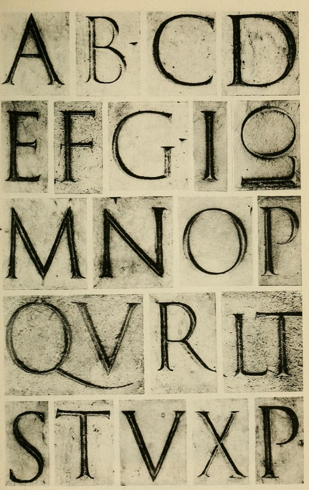
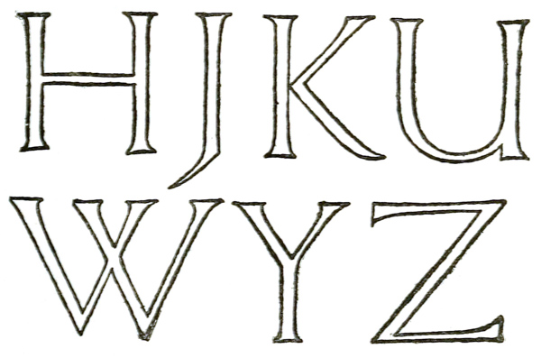

# Plate II — Alphabet from Trajan Inscription

—- description: Alphabet from Trajan Inscription \(Circa 114 A.D.\) —-

## Plate II — Alphabet from Trajan Inscription

THE “TRAJAN” ALPHABET — Very fine letters for inscriptions in stone: possibly painted before incision \(see p. [292](plate-ii-alphabet-from-trajan-inscription.md)\); see also remarks on Roman Capitals, pp. [268](plate-ii-alphabet-from-trajan-inscription.md)–[296](plate-ii-alphabet-from-trajan-inscription.md), and note:—

**SERIFS** — Small and carefully curved.

**THIN PARTS** about half the width of the _thick stems_ \(pp. [375](plate-ii-alphabet-from-trajan-inscription.md), [285](plate-ii-alphabet-from-trajan-inscription.md)\).

**A** \(**M** and **N**\) _pointed_ \(p. [280](plate-ii-alphabet-from-trajan-inscription.md)\).

**B** — a very beautiful form, with large lower _bow_ \(p. [278](plate-ii-alphabet-from-trajan-inscription.md)\).

**C**, **G**, and **D** — Upper parts rather straight \(p. [281](plate-ii-alphabet-from-trajan-inscription.md)\).

**E** and **F** — _mid arm_ slightly shorter than upper arm.

**E** and **L** — _lower serif_ pointed out \(p. [282](plate-ii-alphabet-from-trajan-inscription.md)\).

\[p411\]

**LO** \(shown sideways in collotype\) and **LT** show **L’**s _arm_ projecting under next letter.

**M** — _pointed_: slightly spread \(p. [284](plate-ii-alphabet-from-trajan-inscription.md)\), distance apart of points above equal to _inside_ distance of stems below.

**N** — _pointed_: practically no difference in thickness of vertical and oblique parts \(p. [285](plate-ii-alphabet-from-trajan-inscription.md)\).

**O** — very beautiful: _width slightly less than height_ \(p. [270](plate-ii-alphabet-from-trajan-inscription.md)\); slightly _tilted_ \(as are all the other curved letters: see p. [285](plate-ii-alphabet-from-trajan-inscription.md)\).

**P** — _Bow_ not joined to stem below \(first P rounder topped\).

**Q** — _tail_ carried under V \(U\).

**R** — _large bow_: straight tail, with finishing-curve \(p. [291](plate-ii-alphabet-from-trajan-inscription.md)\).

**S** — leans forward slightly \(p. [286](plate-ii-alphabet-from-trajan-inscription.md)\).

| Proportions of widths to heights \(comp. with pp. 269–273\) |  |
| :--- | :--- |
| **OCDGMNQ** | width slightly _less_ than height. |
| **ARTV** | width approx. 1/6th _less_ than height. |
| **BX** | width rather more than _half_ height. |
| **P** | width approx. equal _half_ height. |
| **LS** | width slightly _less_ than half height. |
| **EF** | width approx. 3/7ths of height. |

