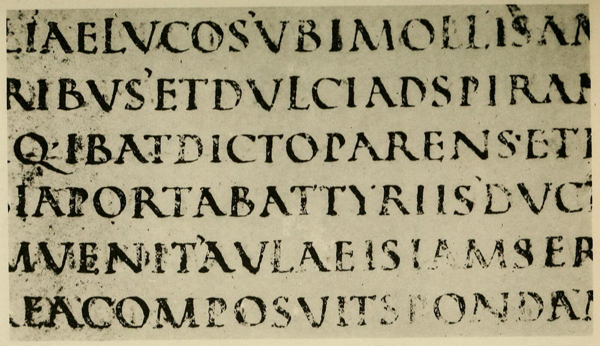

# Plate III — Written Roman Capitals, Fourth or Fifth Century

## PLATE III — Written Roman Capitals, Fourth or Fifth Century. \(Virgil’s “Æneid”\).

\(From a facsimile in the Palæographical Society’s Publications, 1st Series, Vol. II., Pl. 208, of a MS. in the library of S. Gall, Switzerland. See also “Greek and Latin Palæography,” p. 185.\)

**LETTERS** — Simple-written \(slanted-pen\) Roman “Square Capitals.”

**WORDS** in early MSS. were not separated \(p. 112\).

**LINES** ruled with a hard point \(p. 343\). The letters appear to have been written between every alternate pair \(p. 299\), but slightly over the line.

A very handsome writing which might still be used for special MSS. \(see pp. 304, 300, 299\).

