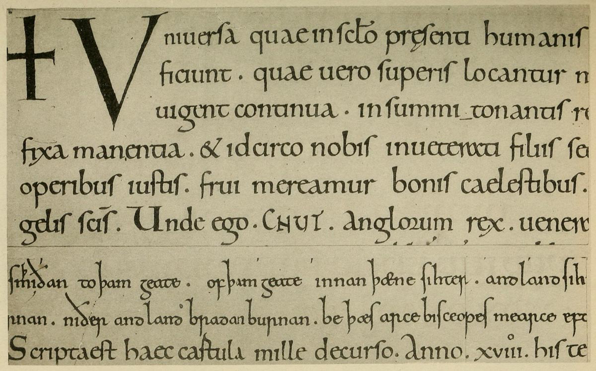
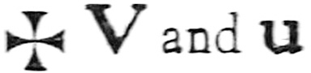
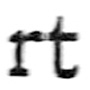

# Plate IX — English Writing, 1018

## _PLATE IX.—English Writing, dated 1018. Two portions of a Charter of CNUT. Brit. Museum._ \(_See also enlargement, fig._ 173.\) \[_Pl. reduced scale_ 11/12_ths._\]  

\(Shown in Brit. Mus., Department of MSS., Case V., No. 3.\)

THE WRITING resembles that in Plate VIII. \[p417\]\(see above\), but is more slender and rounder—the pen being a little less slanted, and the _arches_ more curved, and showing more of the _thin_ stroke. The ascenders and descenders are longer, the heads are more marked, and there is a general elegance and distinction, due perhaps to the MS. being a charter. Charter-hands are generally more showy and less legible than Book-hands, but in this hand there is great legibility, and a very few changes \(similar to those suggested above\) would make it quite suitable for modern use. Its relation to the Roman Small-Letter is obvious.

Notes.—The \(black\)  were probably built-up with the writing pen.

The forms of _**a**_**,** _**e**_**,** _**g**_**, \(**_**h**_**\),** _**r**_**,** may be noted as differing considerably from the tenth-century hand.

The combined _ra_ \(in the 4th line\) is curious; and the _**r**_ **\*\*in** _**Anglorum**_ **— this \_**r**\_ \(which represents the Bow and Tail of** R\*\*\) commonly follows the round letters _b_, _o_, _p_, in “Gothic” writing: there is another curious form in the linked  in _cartula_ \(last line\).

The word **CNUT** and several other names are in ornamental “Rustic” Capitals \(see p. 297\).

The two lines of English from another part of the charter have very long stems and ornamental serifs, giving a very decorative effect \(see _footnote_, p. 326\).

