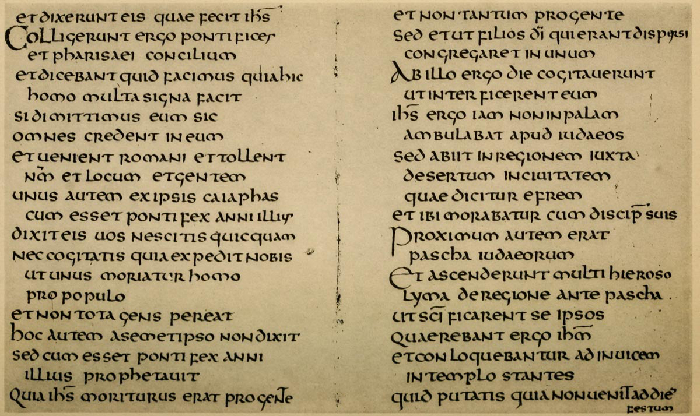

# Plate V — Uncial Writing, probably Continental Seventh Century

## PLATE V — Uncial Writing, probably Continental Seventh Century. \(Gospel of S. John\). Ex libris Stonyhurst College. \(See also enlargement, fig. 169.\)  

\(From a facsimile in the Palæographical Society’s Publications, 1st Series, Vol. II., Pl. 17.\)

THE VOLUME contains 90 leaves, approx. 5 3/8 inches by 3 5/8 inches. The _Inner margin_ is approximately 1/2 inch wide.

WRITING — A very beautiful pointed \(slanted-pen\) Uncial. The “pointed” character of the letters, which yet retain their typical roundness, give this writing a peculiar charm. Note the top of the P has a marked angle, and the M and H, and even the O, have this slightly or strongly.

RULING — Single lines, rather wide \(p. 305\).

ARRANGEMENT — Certain of the lines are _indented_ one letter \(p. 264\).

LARGE LETTERS — On _verso_ Col marking a “Chapter” is built-up in _red_, on _recto_ the three large letters \(marking sections\) are simply written with the text pen \(p. 299\). \(The passage is S. John xi. 46–56.\)

