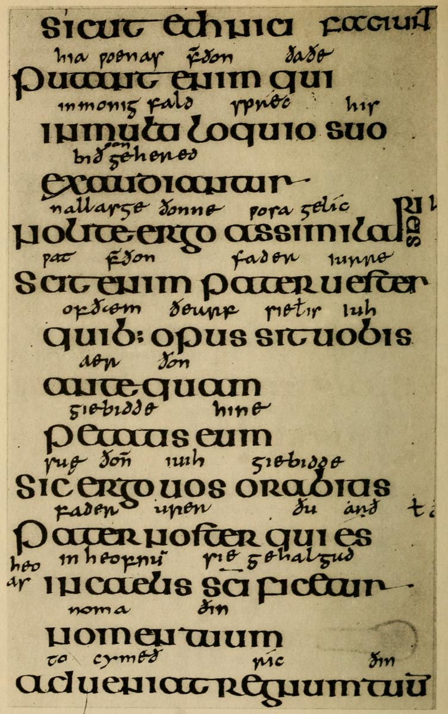

# Plate VII — Half Uncial \(English\), circa 700 A.D.

PLATE VII.—Half-Uncial \(English\), circa 700 A.D. “Durham Book” \(Latin Gospels\). Brit. Mus., Cotton MSS. Nero D. IV.

**THE VOLUME** contains 258 leaves \(1312 inches by 978 inches\).

**THE WRITING** is an English—or rather _Anglo-Irish_—Half-Uncial, written at Lindisfarne \(_Holy I._\) under Irish influence \(p. [40](http://www.gutenberg.org/files/47089/47089-h/47089-h.htm#p040)\). ARRANGEMENT—two columns of 24 lines—long and short—to the page \(note how _eis_ is got into the fifth line\): wide spacing.

The writing bears a strong resemblance to that of the “Book of Kells,” but is generally much plainer; it is also less graceful, being _heavier_ and _wider_ in proportion. The “Book of Kells” **O** is a _circle_, while the “Durham Book” **O** is considerably wider than its height, and all the other letters are correspondingly wide. The RULING in both books consists of double lines, ruled with a hard point _on both sides of each leaf_.

**THE ILLUMINATION** also resembles that of the “Book of Kells” \(see _opposite_\), but a small amount of _gold_ is employed in it. \(See also Palæographical Society’s 1st Series, Vol. II., Pl. 3–6, 22.\)

Note __— The “Gloss,” or interlinear translation, is in the Northumbrian dialect, and was put in in the tenth century, more than 200 years after the book was written.

A hand founded to some extent on the “Durham Book” hand is given in Chap. IV. as an easy copy: see figs. 49, 50.

