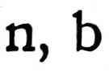
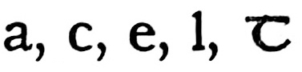
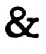
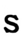
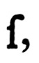
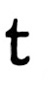
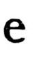

# Plate VIII — English Tenth-century Writing

#### PLATE VIII — English Tenth-century Writing. \(Psalter\). Brit. Mus., Harl. MS. 2904. \(See enlargement, fig. 172\). \(Shown B. M. Grenville Lib. Case 2, No. 9.\) 

THE VOLUME contains 214 leaves \(13 1/4 inches by 10 inches\), 18 lines to the page; probably written at Winchester in late tenth century. \(_Pl. reduced scale_ 8/9_ths._\)

\[p416\]

**WRITING** — An extremely good, formal, “slanted-pen” writing, having great freedom \(note the very slight slope forward\) and simplicity. This type of letter may be regarded as a link between the Half-Uncial and the Roman Small-Letter \(see p. 310\).

**THE RULING**: _single_ lines \(see _footnote_, p. 305\).

**THE LETTERS** show very strongly the effects of the “slanted pen” \(see pp. 43, 305\). Note the heavy shoulders and feet in , &c., and the thick horizontals in , The curved tops or _arches_ are flattish and strong: the thick strokes end in points and are hooked below, thin strokes scarcely appear except as the _finishing strokes_ of , while end in small heavy _hooks_. Note generally the tendency to _internal angles_ and _external roundness_ \(examples, \).

Note particularly the junctions and accidental crossings of the strokes \(seen best in the enlargement, fig. 172\) as bearing on the mode of construction of the letters \(see p. 84\).

Note the fine shape of the _amperzand_ \(: 3rd line\).

**THE ILLUMINATION** \(see _Characteristics of Winchester Illumination, or “Opus Anglicum,”_ pp. 82, 83, Bradley: “Illuminated Letters and Borders”\). _All_ the CAPITALS beginning the verses are in raised, burnished gold, in the margin. The titles are in _red_ in fancy “Rustic Capitals” \(p. 297\). The Line-Fillings consist of groups of red dots, in threes \(\).

This extremely legible MS. would form an almost perfect model for a modern formal hand \( being substituted for long , and the straight  for the curved  \(see fig. 183\): the removal of the  _flourish_ would also help readableness\). And though it is somewhat large and heavy for ordinary use, it is good for practising, and might be developed into a form resembling any of the more difficult later forms \(Plates [IX.](plate-ix-english-writing-1018.md), [X.](plate-x-italian-first-half-of-twelfth-century-writing.md), [XX.](plate-xx-italian-late-fifteenth-century.md)\).

