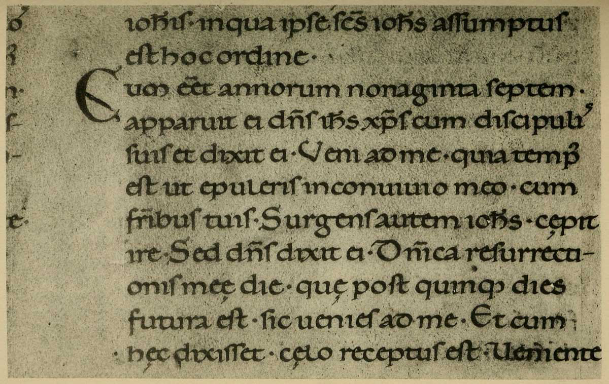

# Plate X — Italian \(first half of\) Twelfth-century Writing

#### PLATE X.—Italian \(first half of\) Twelfth-century Writing. \(Homilies and Lessons\). Brit. Mus., Harl. MS. 7183. \(See also enlargement, fig. 174.\) 

\(Shown in Brit. Mus., Department of MSS., Case C \[lower part\], No. 101.\)

**THE VOLUME** — Homilies and Lessons for Sundays and Festivals from Advent to Easter Eve—contains 317 leaves \(approximately 21 1/2 inches by 15 inches\); two columns, each of 50 lines, to the page. The MARGINS are, approximately, _Inner_ 1 1/4 inch, _Head_ 1 1/4 inch, _Side_ 3 1/4 inches, _Foot_ 4 1/4 inches \(_between columns_ 1 1/8 inch: see Plate\). The portion of a page, shown in Plate X., consists of the last eleven lines, second column, of folio 78.

**WRITING** — This has all the qualities of good writing \(p. 239\) in a marked degree, and I consider it, taken all round, the most perfect and satisfactory penmanship which I have seen.

It’s simplicity and distinctiveness are very marked, so also are its character and freedom. There is an almost entire absence of artificial finish—the terminals are natural hooks, beaks and “feet” made with a fine sleight of hand \(p. 311 \)— and its very great beauty of form is the natural outcome of good traditions and eminently satisfactory craftsmanship.

**Notes** — The letters are very wide, and the _inside shapes_ differ considerably from those of the tenth-century MS. \(above\)—with which, however, there is a considerable affinity \(see p. 416\).

The ****_**f**_ ****is longer than the ****_**ſ**_, the _**g**_ ****has a very fine form with a _closed_ loop, the _**r**_ is sharpened, the _**t**_ ****_straight_.

Small \(Uncial\) CAPITALS _um_ follow the Versal; the serifs on the **S** and **E** are made with dexterous movements of the nib \(p. 246\), and resemble those on the Versal **C**. **V** and **U** are both used for the consonant \(**V**\).

There are very few VERSALS in this book: the **C** shown is in red \(which has been smudged\).

The large “ILLUMINATED INITIALS” in the book are in yellow, blue, and red, and appear to me to be comparatively poor, at least, to fall short of the perfection of the MS.

Of this writing, Sir Edward Maunde Thompson \(“Greek and Latin Palæography,” pp. 271–2\) says:

> “The sense of grace of form which we perceive in the Lombardic writing of Italy is maintained in that country in the later writing of the new minuscule type, which assumes under the pens of the most expert Italian scribes a very beautiful and round even style. This style, though peculiarly Italian, extended \[p419\]its influence abroad, especially to the south of France, and became the model of Spanish writing at a later time. We select a specimen from a very handsome MS. of Homilies of the first half of the 12th century \(Pal. Soc. ii. pl. 55\), written in bold letters of the best type, to which we shall find the scribes of the fifteenth century reverting in order to obtain a model for their MSS. of the Renaissance. The exactness with which the writing is here executed is truly marvellous, and was only rivalled, not surpassed, by the finished handiwork of its later imitators.
>
> “It will of course be understood that this was not the only style of hand that prevailed in Italy. Others of a much rougher cast were also employed. But as a typical book-hand, which was the parent of the hands in which the greater proportion of carefully written MSS. of succeeding periods were written in Italy, it is to be specially noticed.”
>
> \(P. 284\)—“we give a specimen of a hand of the Italian Renaissance, a revival of the style of the eleventh or twelfth century, and a very successful imitation of a MS. of that period. It was this practice, followed by the scribes of the Renaissance, of reverting to that fine period of Italian writing \(see p. 272\) to find models for the exquisitely finished MSS. which they were compelled to produce in order to satisfy the refined taste of their day, that influenced the early printers of Italy in the choice of their form of type.”[131](../footnotes-f/131.md)
>
> \(P. 285\)—“in the comparatively small number of extant literary MSS. of a later date than the close of the \[fifteenth\] century it is noticeable that a large proportion of them are written in the style of the book-hand of the Italian Renaissance—the style which eventually superseded all others in the printing press. The scribes of these late examples only followed the taste of the day in preferring those clear and simple characters to the rough letters of the native hands.”

