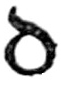
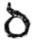
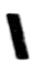
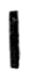
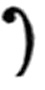

# Plate XI — English \(late\) Twelfth-century Writing with Flourished Capitals

#### _PLATE XI.—English \(late\) Twelfth-century Writing, with flourished Capitals. \(Breviary\). Brit. Mus., Royal MS. 2. A. x._ 

\(Shown in Brit. Mus., Department of MSS., Case D, No. 111.\)

**THE VOLUME**—sometimes called the St. Albans or _Albanus_ Psalter—contains 200 leaves \(678 inches by \[p420\]478 inches\); twenty-seven lines to the page, some pages have two columns. MARGINS, approximately, _Inner_ 58 inch, _Head_ under 12 inch \(see Plate\), _Side_ 114 inch \(part occupied by Versals\), _Foot_ 118 inch.

**THE WRITING** is fairly legible, but approaches Black Letter \(p. 331\) too nearly to be of use to us for ordinary purposes. Note the ornamental Semi-Rustic Capitals in text. Note the RULING of the two head lines and of the foot line is carried into the margin.

**THE VERSALS.**—The main interest lies in the varied forms of the Versals, which are most beautifully made in _red_ and _green_ alternately. There is one elaborate _gold_ initial in the book, and several Versals in blue and white \(_hollow_: see p. 208\).

The five ’s—and the **D** in the text—on this page \(folio 85b\) by no means exhaust the varieties of **D** alone, and there are very many varieties of the forms of the other letters. On some pages each line begins with a small Versal, while the more important Initials are much larger, varying in size and ornament.

**THE CONSTRUCTION** of the Versals is unusually slender, curved, and gradated. A rather fine pen seems to have been used \(p. 292\), and though the letters are upright, the natural tendency to slant the pen can be detected in the thickening of the thin parts—_above_, on the right, and _below_, on the left—giving the suspicion of a _tilt_ to the O.

The **O**-part of each  was made first, and the tail  added. This is very obvious in the _D_ in the text, where a stem  was added to **O** to make **D**.

Note the _dots_ inside the Versals, one above and one below. Originally these may have been intended to effect—or hide—the junction of the thin strokes, by a twirl of the pen at the end of the first stroke and the beginning of the second, thus . Their use is very common in Versal forms \(see fig. 189\), and besides being decorative in the ordinary sense, they may be said to strengthen the thin parts \(much as the weakest part of the loop in an old key was thickened for strength\).

Note the right-hand Bows of the ’s are made thinner, as though the Rubricator had been afraid of running into the text in making their last curves—such an expert, however, may well have had a better reason for it.

