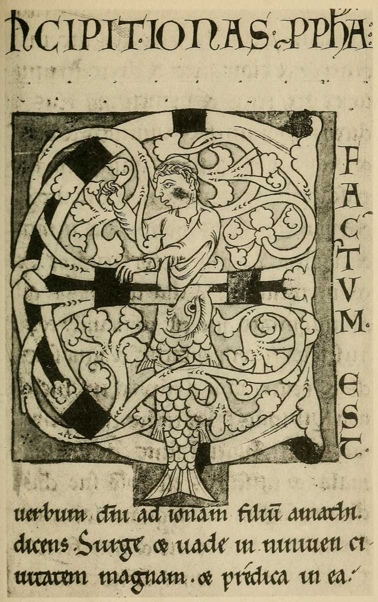
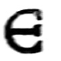
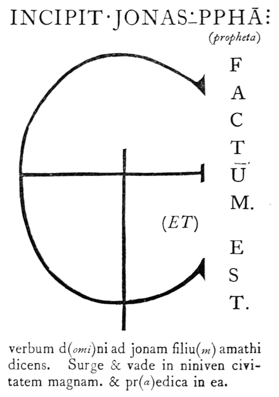

# Plate XII — Illuminated Initial in a Flemish MS. A.D. 1148

**PLATE XII**.—Illuminated Initial in a Flemish MS. A.D. 1148. \(Latin Bible\). Brit. Museum, Addl. MS. 14790.

\(Shown in Brit. Museum, Department of MSS., Case C, No. 91.\)

**THE VOLUME**—the _third_, and most interesting, of this MS. Bible \(Numbered 14788–89–90\)—contains 223 leaves \(17 inches by 11 7/8 inches\). MARGINS, approximately, _Inner_ 1 1/8 inch, _Head_ \(_cut_\) 1 inch, _Side_ 2 3/8 inches, _Foot_ 3 1/2 inches. \(Between columns 15/16 inch.\)

**THE WRITING** is a not very legible “Gothic.” The _zigzag_ tendency exhibited, especially by the word _niniuen_ \(Niniveh\), second line, is unsuited for such _formal_ writing \(see p.484\). The rapid placing of the Heads of the letters is such that they appear broken and partly detached from the _stems_. The VERSALS are of a good type.

**THE INITIAL** is a monogrammatic ET. The arms of the round  terminate in leaves folded back, its form is _hollow_ and _inwoven_ \(p. 208\), and gives rise to foliage, which fills the interior—passing over the fish and behind Jonah. Note also how the jaws of the fish are interlaced, and how compactly _all_ the parts are put together.

The close application of the background to the _curves_ adds to the general compactness, and together with its spacing from the _straight_ front _balances_ the masses \(p. 424\): it may be compared to the even spacing of curved and straight strokes \(see fig. 53\). There is an extension of the background to hold the fish’s tail.

| THE COLOURS— |  |
| :--- | :--- |
| Initial, Foliage, Fish: | red: outlined & lined; _Parchment left plain_. |
| Jonah: | black: outlined & lined; _Parchment left plain_. |
| Bands on Initial, | _gold_, outlined _red_. |
| Hollows in Initial, | _gold_, outlined _red_. |
| Backs of folded leaves: | _gold_, outlined _red_. |
| Outer background: | _paled green._ |
| Dots on outer ground: | _red._ |
| Inner background: | _paled blue._ |

We may not, I think, attempt to imitate the complex 12th-century decoration of this initial \(see p. 196\), but the treatment of the _elements_ of form and colour is very suggestive, and the whole piece of lettering is characteristic of the grand style in which a book was at that time begun. The **ARRANGEMENT** of the letters themselves is very simple, and might be made good use of \(fig. 220\).

