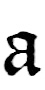
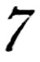
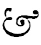

# Plate XIII — English \(2nd half\) Thirteenth-century

**PLATE XIII**.—English \(2nd half\) Thirteenth-century Writing and Illumination. \(Latin Bible\). Ex libris S. C. Cockerell.

**THE VOLUME**—probably written at York—contains 427 leaves \(8 inches by 5 1/2 inches\): two columns to the page: MARGINS, approx.: Inner 58 inch, _Head_ 58 inch, _Side_ 78 inch, _Foot_ 1716 inch. \(Between the columns 38 inch.\) The pages have been cut down.

**THE WRITING** is very small, and there are many contractions.[\[f132\]](../footnotes-f/132.md) In the thirteenth and fourteenth centuries the whole Bible, written in this fashion, was often small enough to be carried in the pocket. Note the closed  and the  form of **&**. The page is RULED with 50 lines; the 49 lines of writing lie between these, so that in each case the _ascenders_ touch the line above, and the _descenders_, the line below. Note the double lines in the Foot margin \(see p. 343\).

**VERSALS**.—A very narrow type is used in the narrow margins: the example shown is in red, flourished blue; it begins the second chapter \(_Et angelo ephesi,_ _c._\), which is also marked by coloured Roman Numerals at the side \(II\). The page heading is “APOCA” in small red and blue Versals.

**THE ILLUMINATED INITIAL** is “historiated”—_i.e._ it contains a picture illustrating the text, viz. a representation of S. John writing to the Seven Churches—purely conventional forms, or rather symbols, for the most part, are used and beautifully fitted into the available space. The greater size and more careful drawing of the human figure \(the centre of interest\) is characteristic of a fine convention. The slope of the vellum page on which S. John is writing, and even the manner in which the quill is held, are such as would naturally be employed by a scribe \(see _frontispiece_, & p. 67\).

The _capitals_ of the pillars mark the position of the cross-bar of A. The top serif is carried up and forms a bud, which gives rise to leaf-like flourishes; the free thin stem runs down forming a grotesque, which gives out a leaf-like tongue. In either case the object—in every sense _recreative_—is a renewal of interest in the designed, elongated, growth of the forms.

Note the curved thickening of A’s left stem ends nearly level with the foot of the right stem. This gives balance to the letter \(see **R**, fig. 81 & **A**, fig. 189\), and preserves the _essential form_, which suffers no distortion by the thinner continuation below.

Note the balancing of the background mass on the _straight_ and _curved_ sides of the Initial \(as in [Plate XII.](plate-xii-illuminated-initial-in-a-flemish-ms.-a.d.-1148.md), see above\); also the extension and shape of the background accompanying the drawn out parts of the letter.

| COLOURS of Initial— |  |
| :--- | :--- |
| Right stem: | _red_ with _white_ lines and patterns. |
| Left stem and serif: | _blue_ with _white_ lines and patterns. |
| L. stem, lower half, & dragon: | _pale “lake.”_ |
| The background \(_counter-charged_\) |  |
|   outer: | _pale “lake.”_ |
|   inner: | _blue_. |
|   lower extension: | _blue_. |
|   final flourish: | _pale “lake.”_ |
| Band \(dark\) down left side, dragon’s wings, 6 “berries,” halo, seat, tops of pillar caps: | _burnished gold._ |
| Leaves \(dark\) & pillar caps: | _red._ |
| Small stems & leaves: | _green._ |

Here again no natural work would come of a modern attempt to imitate so complex a “design”—natural and even inevitable _600 years ago_. But the spirit of delicacy and fantasy, the ingenious contrivance, and the balancing and disposal of form and colour shown by the antique art, may well be matter for imitation by the modern draughtsman-illuminator, and even by the mere penman.

