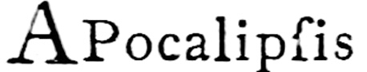
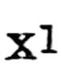

# 132

[132](http://www.gutenberg.org/files/47089/47089-h/47089-h.htm#FNanchor_132) The Apocalypse here begins “ ![i\[=h\]u](../.gitbook/assets/i423c4-2.jpg) ” \(for ![I\[=H\]U](../.gitbook/assets/i423c5.jpg) ![X\[=P\]I](../.gitbook/assets/i423c5-2.jpg), derived from the Greek and used as a mediæval Latin contraction for _Jesu Christi_\).

