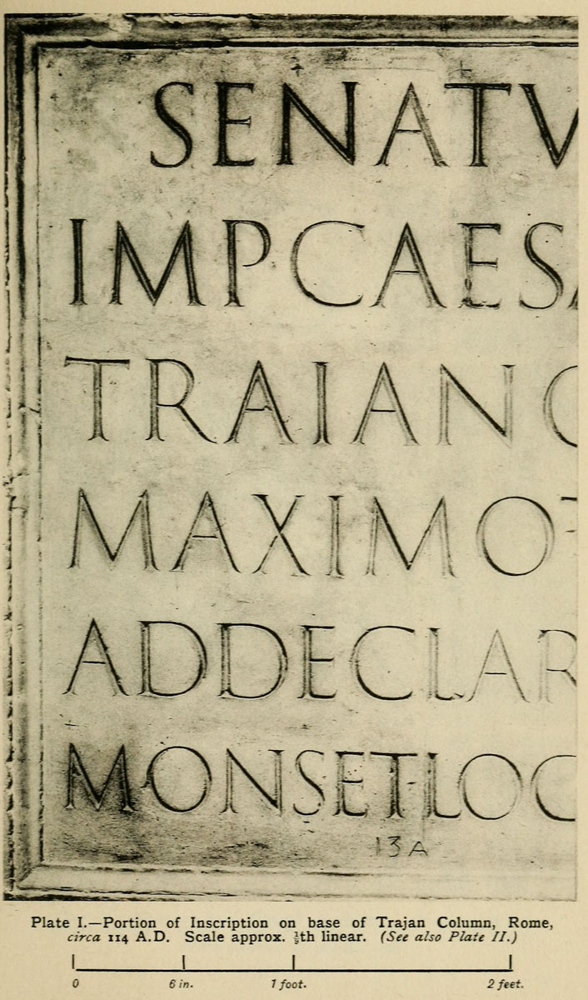

—-
description: 'Portion of Inscription on base of Trajan Column, Rome, circa 114 A.D.'
—-

# Plate I: Portion of Inscription on base of Trajan Column

#### PLATE I.—Portion of Inscription on base of Trajan Column,\[130\] Rome, circa 114 A.D. Scale approx. 1/9th linear. 

THE STONE \(within the internal line of the moulding\): 3 feet 9 inches high, and 9 feet 34 inch long.\[p410\]

THE BORDERS.—The lettering practically fills the panel \(see p. 352\): the surrounding moulding is approx. 4 inches wide.

THE LETTERS \(_for their forms_ see next note\).

* First two lines: 4 1/2
* Second two lines: 4 3/8
* Fifth line: 4 1/8
* Last line: 3 7/8 All approximate heights, inches

THE SPACES \(between Lines\) decrease from 3 inches to 234 inches. A decrease in the height of the letters from the top to the foot line is common in early inscriptions \(see figs.203–205\). Several reasons for this suggest themselves: \(_a_\) \(Sometimes the beginning words, being farther from the reader, may require to be larger\). \(_b_\) The architectural beauty of a large heading \(comp. _stem heads_, p. 288\). \(_c_\) The importance of _beginnings_ generally \(there is very often a marked difference between the upper lines containing important words and the rest of the inscription: comp. figs. 197, 91\).

Note — The WORDS are separated by triangular points \(p. 384\).

