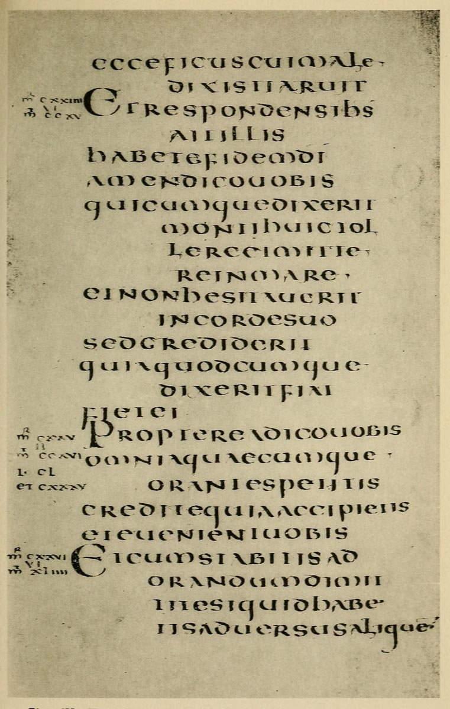

# Plate IV — Uncial Writing, probably Italian Sixth or Seventh Century

#### PLATE IV — Uncial Writing, probably Italian Sixth or Seventh Century. \(Latin Gospels\). Brit. Museum, Harl. MS. 1775. 

\(Shown in Brit. Mus. Department of MSS., Case G, No. 11.\)

THE VOLUME contains 468 leaves \(7 inches by 434 inches\).

MARGINS, Approx.: _Inner_ 58 inch, _Head_ 7/8 inch, _Side_ 9/8 inch, _Foot_ 1 inch. \(They may have been cut down by the binder.\)

WRITING — A fine _round_ Uncial MS. \(pp. 38, 302\), arranged in long and short lines.

Note — On many of the letters there are fine hair-line curved _tails_ and _flourishes_, which are scarcely visible in the photograph. \(These tails were also used in the earlier Uncial shown in fig. 5 — see also _Addenda_, p. 23.\)

SECTIONS —  Marked by built-up letters of an Uncial type, and numbered, mr cxxiiii to mr cxxvi \(with references to “Harmonies”\). The passage is S. Mark xi. 21–25.

\[p413\]  

