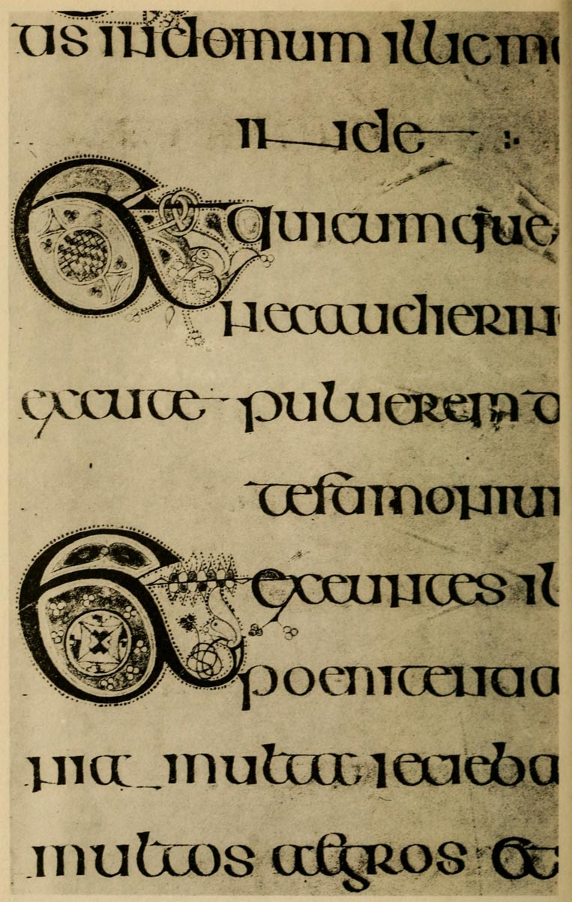

# Plate VI — Half Uncial \(Irish\), Seventh Century, Book of Kells

#### _PLATE VI.—Half-Uncial \(Irish\), Seventh Century. “Book of Kells” \(Latin Gospels\). Ex libris Trinity College, Dublin._ 

\(From a facsimile—part of Pl. XLVII.—in “Celtic Ornaments from the Book of Kells,” by the Rev. Dr. T. K. Abbott.\)

THE LEAVES — which are cut down and much damaged—measure 13 inches by 10 inches.

WRITING — A beautiful and highly finished \(approx. straight pen\) Half-Uncial \(pp. 40, 304\), tending to ornamental and fanciful forms whenever opportunity offered. \(Note the treatment of inde.\)

ARRANGEMENT — Long and short lines: wide spacing.\[p414\]

THE LETTERS combine extreme gracefulness with an unusual appearance of strength. This is mainly due to the ends of _all_ the strokes being finished; the thick strokes have large, triangular heads \(p. 327\) on the left, and bases broadened by an additional stroke below on the right \(thus \). And the horizontal thin strokes are either finished with a triangular terminal \(p. 246\), or run on into the next letter—_joining the letters together_.

The extreme _roundness_ of the letters is contributed to by their being written between DOUBLE LINES \(pp. 304, 88\), the upper line of which tends to flatten the tops.

The pen not being quite “straight” \(see _footnote_, p. 304\), together with a tendency to _pull_ the left hand curves, gives a characteristic shape to the letters 

THE ILLUMINATION throughout the book is most elaborate and beautiful. Each division has an entire Initial page occupied with the first few letters. The COLOURS were “_paled green_, _red_, _violet_, _and yellow_, _intense black_, _and white_, _but no gold_”: see description of Celtic MSS., p. 40, Bradley’s “Illuminated Letters and Borders,” and also the Palæographical Society’s 1st Series, Vol. II., Pl. 55–58, 88, 89.

This notable book may be taken as an example of the marvellous possibilities of pen-work and complex colour-work \(see p. 216\).

In considering the value of the writing as a model, it may be noted that its highly finished nature demands practised skill on the part of the copyist, and that though modern _Irish writing_ \(for which it would be an excellent model\) still employs  these letters would be apt to look peculiar in English. The Kells MS.  however, might be used, and a very beautiful ornamental hand \(p. 304\) might be founded on this writing.

\[p415\]

